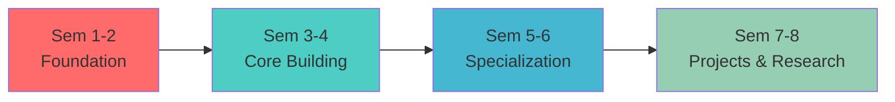

<div align="center">

#  B.Tech Computer Science & Engineering
### Pondicherry University | 2024-25


---

##  Program Overview

<table>
<tr>
<td width="50%">

### Duration
**4 Years** (8 Semesters)  
3 Years for Lateral Entry

### Total Credits
**169** Credits

</td>
<td width="50%">

### Specializations
- Honors Degree
- Minor Degree  
- Exit Options (UG Diploma/B.Sc.)

### Intake
Based on **CUET**

</td>
</tr>
</table>

---

##  Course Categories

<div align="left">

| Category | Credits | Key Focus |
|:---------|:-------:|:----------|
|  **Humanities & Social Sciences** | 13 | Management, Ethics, Communication |
|  **Basic Sciences** | 24 | Mathematics, Physics, Chemistry |
|  **Engineering Sciences** | 26 | Electronics, Programming, Graphics |
|  **Professional Core** | 68 | DSA, Networks, AI/ML, Databases |
|  **Professional Electives** | 12 | Cloud, IoT, Security, Mobile Dev |
|  **Open Electives** | 9 | Cross-domain Learning |
| **Projects & Internship** | 17 | Hands-on Experience |

</div>

---

##  Semester-wise Journey



---

##  Key Highlights

<div align="left">

###  Modern Curriculum
- Cloud Computing & Big Data
- AI & Machine Learning
- IoT & Blockchain
- Cyber Security

###  Practical Learning
- 45+ Lab Sessions
- Industry Projects
- Internship Programs
- Hands-on Tools

###  Flexible Learning
- NEP 2020 Compliant
- Multiple Exit Options
- Honors/Minor Programs
- NPTEL Integration

###  Career Ready
- Industry Collaborations
- Skill Development
- Research Opportunities
- Global Standards

</div>

---

## 📖 Sample Courses

<details>
<summary><b> Core Courses (Click to expand)</b></summary>

- Data Structures & Algorithms
- Computer Networks
- Database Systems
- Operating Systems
- Artificial Intelligence & ML
- Compiler Design
- Web Technology
- Cyber Security

</details>

<details>
<summary><b> Elective Courses (Click to expand)</b></summary>

- Cloud Computing
- Big Data Analytics
- Mobile Computing
- Blockchain Technologies
- Deep Learning
- IoT Applications
- Ethical Hacking
- AR/VR Development

</details>

---

##  Career Paths

<table>
<tr>
<td align="center" width="25%">

**Software Engineer**  


</td>
<td align="center" width="25%">

**Data Scientist**  


</td>
<td align="center" width="25%">

**AI/ML Engineer**  


</td>
<td align="center" width="25%">

**Cyber Security**  


</td>
</tr>
</table>

---

##  Credit Distribution

```
Humanities & Social Sciences   ████████░░░░░░░░░░ 13 (7.7%)
Basic Sciences                 ██████████████░░░░ 24 (14.2%)
Engineering Sciences           ███████████████░░░ 26 (15.4%)
Professional Core              ████████████████████████████████████ 68 (40.2%)
Professional Electives         ███████░░░░░░░░░░░ 12 (7.1%)
Open Electives                 █████░░░░░░░░░░░░░ 9 (5.3%)
Projects & Internship          ██████████░░░░░░░░ 17 (10.1%)
```

---

##  Special Features

<div align="center">

| Feature | Description |
|:--------|:------------|
| **Honors Program** | Additional 20 credits in specialized domain |
| **Minor Degree** | Cross-disciplinary learning opportunity |
| **Multiple Exits** | UG Diploma (2 yrs) \| B.Sc. (3 yrs) \| B.Tech (4 yrs) |
| ** NPTEL Credits** | Up to 9 credits through online courses |
| **Industrial Training** | Mandatory workshops and visits |
| **Design Thinking** | Innovation-focused curriculum |

</div>

---

##  Get Started

<div align="center">

### Ready to Begin Your Journey?


**Admission through CUET**

[View Complete Syllabus](#) | [Apply Now](#) | [Contact Us](#)

</div>

---

<div align="center">

### Excellence in Education | Innovation in Learning | Success in Career


</div>

---

<sub>Pondicherry University</sub>

</div>
